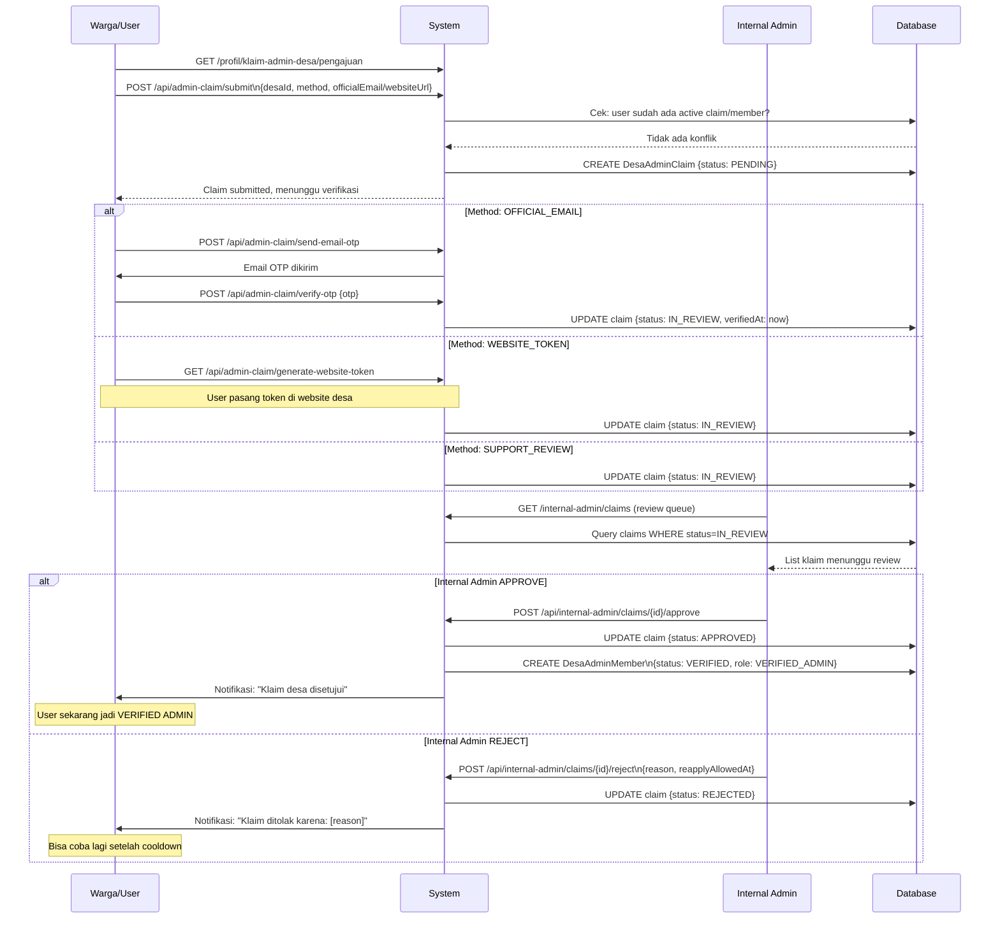
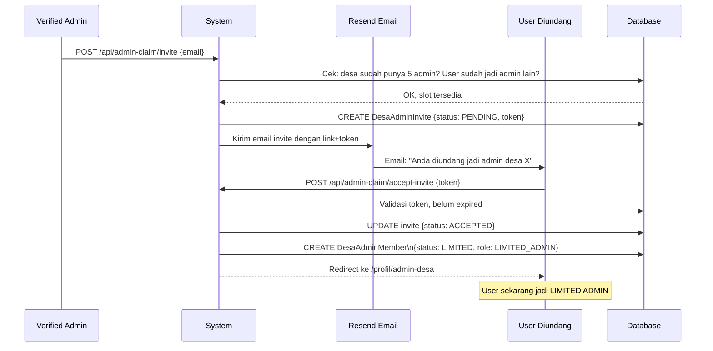
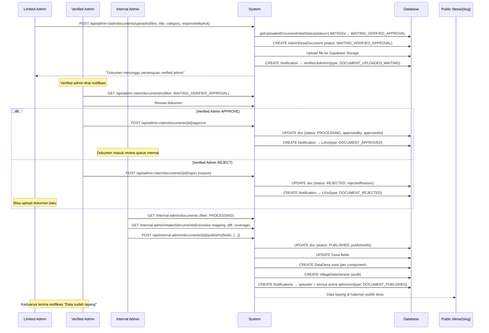
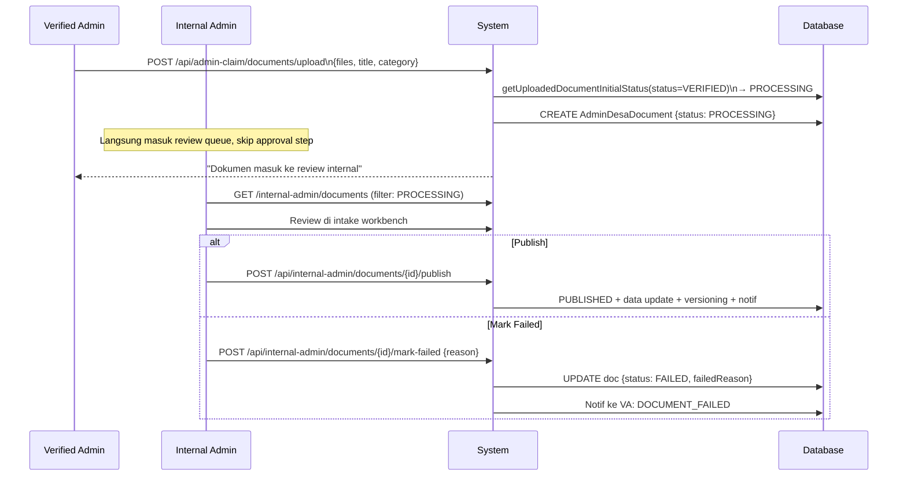
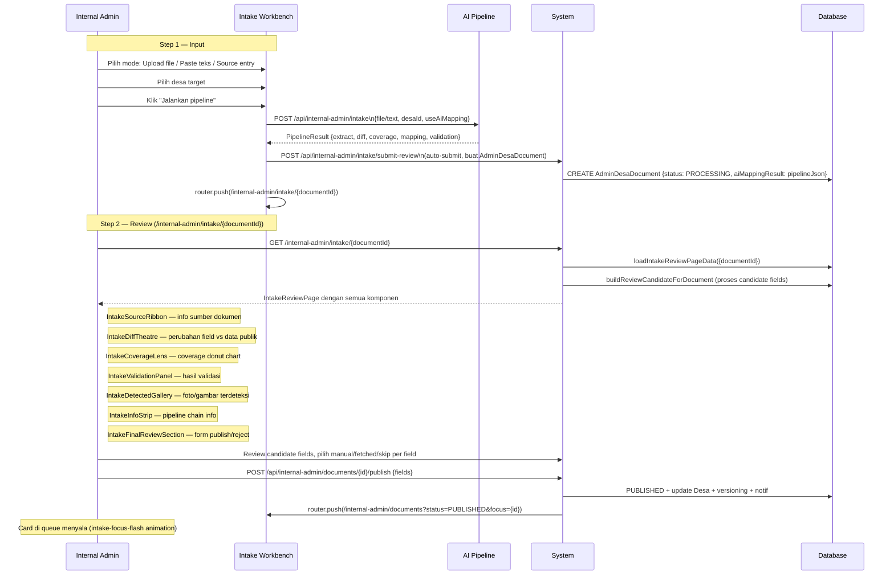
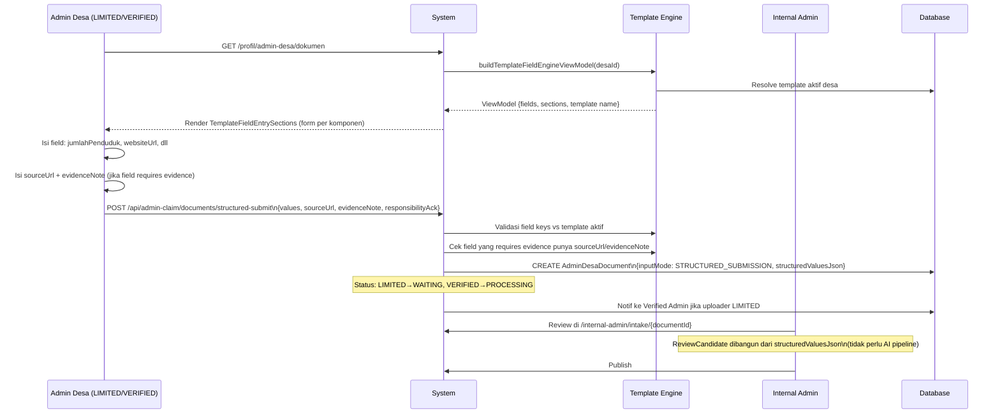

# Back-Office Role & Flow Reference — PantauDesa

> Dibuat: 2026-06-02. Dokumen referensi hasil studi mendalam seluruh sistem back-office.
> Update dokumen ini setiap kali ada perubahan signifikan pada role, flow, atau permission.

---

## 1. Role Matrix

| Role | Tipe | Di mana | Akses |
|---|---|---|---|
| **Warga** | User biasa | Public | Hanya baca halaman publik, kirim suara |
| **Limited Admin** | Admin Desa | `/profil/admin-desa/*` | Upload dokumen/data, lihat status |
| **Verified Admin** | Admin Desa | `/profil/admin-desa/*` | Semua Limited + approve/reject, invite/revoke member |
| **Internal Admin** | Tim PantauDesa | `/internal-admin/*` | Publish data, kelola template, verifikasi klaim |

**Catatan penting:**
- **Verified Admin ≠ Internal Admin** — dua role yang benar-benar berbeda
- Verified Admin adalah warga/staf desa yang sudah terverifikasi; Internal Admin adalah tim PantauDesa
- Internal Admin bisa akses SEMUA desa; Verified Admin hanya desa-nya sendiri
- Satu desa hanya boleh punya **1 Verified Admin** (enforced di DB)
- Satu user hanya bisa jadi admin untuk **1 desa** (enforced di API)

---

## 2. Document Status State Machine

```
WAITING_VERIFIED_APPROVAL  ←── LIMITED admin upload
        │
        ├─[Verified admin APPROVE]──► PROCESSING
        └─[Verified admin REJECT]───► REJECTED (terminal)
        └─[Internal admin override]─► PROCESSING (fallback jika tak ada verified)

PROCESSING  ←── VERIFIED admin upload (langsung skip waiting)
        │
        ├─[Internal admin PUBLISH]──► PUBLISHED (terminal, data tayang)
        └─[Internal admin FAILED]───► FAILED (terminal, error teknis)
```

**Status enum:** `WAITING_VERIFIED_APPROVAL | PROCESSING | PUBLISHED | REJECTED | FAILED`

---

## 3. Sequence Diagram: Claim Desa (Onboarding Admin Baru)



---

## 4. Sequence Diagram: Invite LIMITED Admin (oleh Verified Admin)



---

## 5. Sequence Diagram: LIMITED Admin Upload & Approval Chain



---

## 6. Sequence Diagram: VERIFIED Admin Upload (Fast Path)



---

## 7. Sequence Diagram: Internal Admin — Intake Workbench Flow



---

## 8. Sequence Diagram: Structured Data Submission (Template-Based)



---

## 9. Notification Chain Lengkap

| Kapan | Notif ke | Type | Channel |
|---|---|---|---|
| LIMITED upload | Verified Admin | `DOCUMENT_UPLOADED_WAITING` | in_app |
| Verified APPROVE | Uploader (LIMITED) | `DOCUMENT_APPROVED` | in_app |
| Verified REJECT | Uploader (LIMITED) | `DOCUMENT_REJECTED` | in_app |
| Internal PUBLISH | Uploader + semua active admin | `DOCUMENT_PUBLISHED` | in_app |
| Internal FAILED | Uploader | `DOCUMENT_FAILED` | in_app |
| Claim APPROVED | User yang klaim | `CLAIM_APPROVED` | in_app |
| Claim REJECTED | User yang klaim | `CLAIM_REJECTED` | in_app |
| Template berubah | Semua admin desa affected | `TEMPLATE_COMPONENTS_CHANGED` | in_app |
| Template assignment berubah | Semua admin desa affected | `TEMPLATE_ASSIGNMENT_CHANGED` | in_app |
| Renewal due soon | Verified Admin | `RENEWAL_REMINDER` | in_app + email |
| Renewal expired | Verified Admin | `RENEWAL_EXPIRED` | in_app + email |

---

## 10. Permission Matrix Lengkap

| Action | Warga | Limited Admin | Verified Admin | Internal Admin |
|---|:---:|:---:|:---:|:---:|
| Lihat halaman publik desa | ✅ | ✅ | ✅ | ✅ |
| Kirim suara warga | ✅ | ✅ | ✅ | ✅ |
| Upload dokumen/data | — | ✅ | ✅ | — |
| Lihat status dokumen sendiri | — | ✅ | ✅ | ✅ |
| Approve dokumen (LIMITED upload) | — | — | ✅ | ✅ (fallback) |
| Reject dokumen (LIMITED upload) | — | — | ✅ | — |
| Invite LIMITED admin | — | — | ✅ | — |
| Revoke LIMITED admin | — | — | ✅ | — |
| Review intake workbench | — | — | — | ✅ |
| Publish dokumen ke desa | — | — | — | ✅ |
| Mark dokumen failed | — | — | — | ✅ |
| Verifikasi klaim admin desa | — | — | — | ✅ |
| Approve/reject renewal | — | — | — | ✅ |
| Kelola template desa | — | — | — | ✅ |
| Assign template ke desa | — | — | — | ✅ |

---

## 11. Arsitektur File Kunci

```
AUTH & SESSION
├── src/lib/auth.ts                                      NextAuth config (credentials + magic link)
├── src/lib/auth/internal-admin.ts                       requireInternalAdminSession()
└── src/lib/data/admin-desa-context.ts                   requireAdminDesaContext()

POLICY & RULES
├── src/lib/admin-desa/policy.ts                         isVerifiedAdminMember(), getUploadedDocumentInitialStatus()
├── src/lib/admin-claim/status.ts                        State machine transitions
├── src/lib/admin-claim/eligibility.ts                   Eligibility checks (one user, one desa, dll)
└── src/lib/admin-desa/document-categories.ts            Category validation dari template

DOCUMENT REVIEW
├── src/lib/internal-admin/document-review-service.ts    Publish logic + versioning + notif
├── src/lib/internal-admin/review-candidate.ts           buildReviewCandidateForDocument()
└── src/lib/internal-admin/intake-review-page.ts         loadIntakeReviewPageData()

TEMPLATE SYSTEM
├── src/lib/village-data/template-resolver.ts            Resolve template aktif per desa
├── src/lib/village-data/component-catalog-manifest.ts   12 komponen terdaftar
├── src/lib/village-data/public-detail-composition.ts    Render plan (slot + registry)
└── src/lib/internal-admin/template-management-service.ts CRUD template

KEY UI COMPONENTS
├── src/components/admin-desa/AdminDesaDokumenClient.tsx           Upload + list + approve UI
├── src/components/internal-admin/IntakeWorkbench.tsx              Step 1 workbench
├── src/components/internal-admin/intake/IntakeReviewPage.tsx      Step 2 review
└── src/components/internal-admin/InternalDocumentReviewQueue.tsx  Document queue

API ROUTES — ADMIN DESA
├── src/app/api/admin-claim/documents/upload/route.ts              File upload
├── src/app/api/admin-claim/documents/structured-submit/route.ts   Data terstruktur
├── src/app/api/admin-claim/documents/[id]/approve/route.ts        Approve by Verified
└── src/app/api/admin-claim/documents/[id]/reject/route.ts         Reject by Verified

API ROUTES — INTERNAL ADMIN
├── src/app/api/internal-admin/documents/[id]/publish/route.ts     Publish by Internal
└── src/app/api/internal-admin/documents/[id]/mark-failed/route.ts Mark failed by Internal
```

---

## 12. Business Rules Kritis

1. **1 user → 1 desa** — User tidak bisa jadi admin di 2 desa bersamaan
2. **1 Verified per desa** — Enforced saat claim approval (query `existingVerified`)
3. **Max 5 admin per desa** — Enforced di invite endpoint
4. **LIMITED upload → WAITING** — Wajib melewati approval Verified Admin
5. **VERIFIED upload → PROCESSING** — Langsung masuk internal review (bypass approval)
6. **Internal Admin adalah satu-satunya yang bisa PUBLISH** — Tidak ada path lain
7. **Terminal states tidak bisa di-undo** — PUBLISHED, REJECTED, FAILED bersifat final
8. **Cooldown pada rejection klaim** — `fraudCooldownUntil` + `reapplyAllowedAt` enforced
9. **Renewal expiry** — Jika overdue, status VERIFIED bisa turun ke EXPIRED
